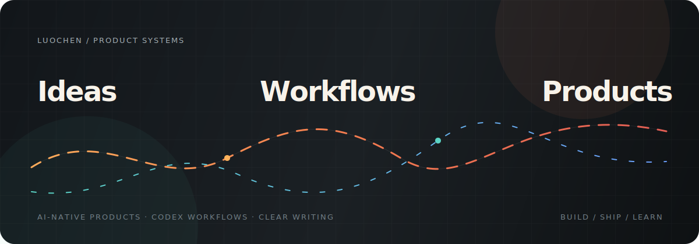

  <picture>
    
  </picture>

<h1 align="center">I turn messy knowledge work into AI-native products.</h1>

  I build with Codex, full-stack systems, and clear writing — mostly for content, documents, research, and business operations.

  <a href="https://luo-chen.com">Personal site</a> ·
  <a href="https://x.com/luochenkafei">X</a> ·
  <a href="https://github.com/luochen211?tab=repositories">Repositories</a>

## Selected Work

<table>
  <tr>
    <td width="50%" valign="top">
      <h3><a href="https://github.com/santifer/career-ops">career-ops</a></h3>
      
Open-source AI job-search infrastructure with <strong>59K+ stars</strong>, built to make applications a more reliable workflow.

      
<strong>30 merged PRs</strong> across safety, compensation integrity, scanning reliability, PDF generation, system updates, and cross-CLI workflows.

    </td>
    <td width="50%" valign="top">
      <h3>Codex Workflows</h3>
      
Reusable agent skills and development workflows for writing, research, documents, and product delivery.

      
<strong>Focus:</strong> make AI useful in the daily work between an idea and a shipped result.

    </td>
  </tr>
  <tr>
    <td width="50%" valign="top">
      <h3>Product Experiments</h3>
      
Small, sharp web apps that turn ambiguous processes into clear interfaces and repeatable systems.

      
<strong>Typical shape:</strong> a fast prototype with a real user, a real workflow, and a short feedback loop.

    </td>
    <td width="50%" valign="top">
      <h3>Writing &amp; Knowledge Tools</h3>
      
Practical guides, course materials, and document systems that make complex thinking easier to use.

      
<strong>Principle:</strong> clarity is part of the product, not a layer added after the build.

    </td>
  </tr>
</table>

## Now

- Building AI agents that help with real work instead of demos
- Turning Codex workflows into reusable skills and production habits
- Exploring productized automation for content, documents, research, and operations

## Tools I Use

**AI &amp; Automation** · OpenAI · Codex · Agent Workflows · Workflow Automation 
**Product Engineering** · TypeScript · JavaScript · React · Vue 
**Backend &amp; Data** · Python · FastAPI · Flask · Shell

  Ideas are cheap. Useful systems are not.

