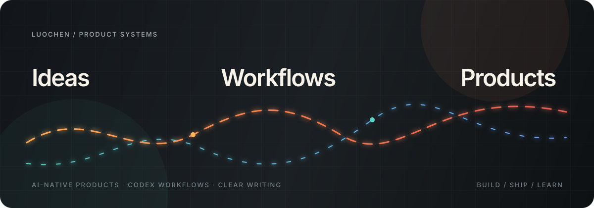
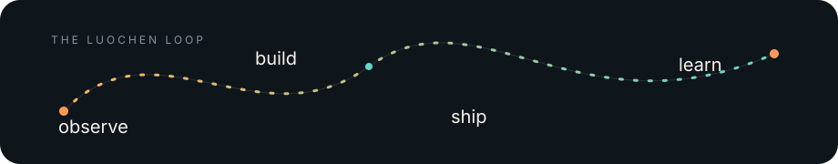
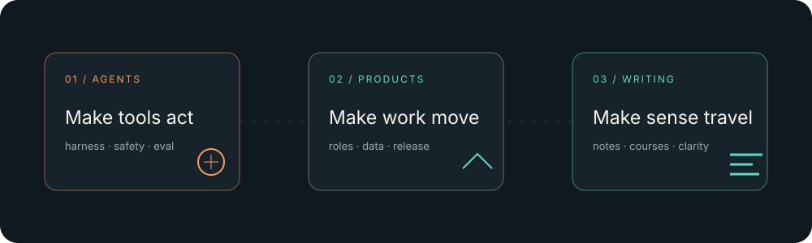
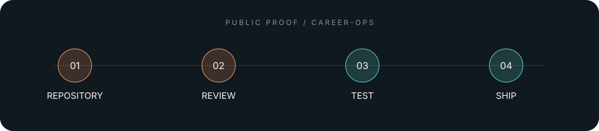
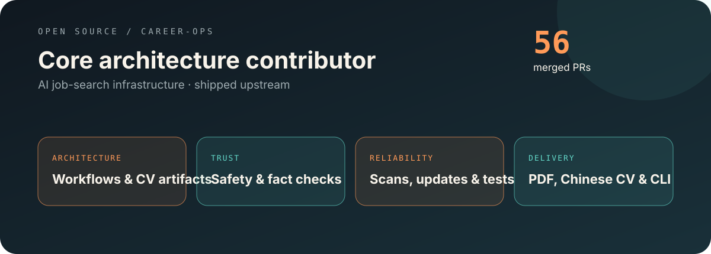
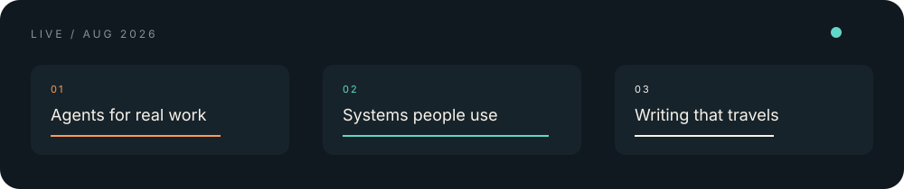

  <picture>
    
  </picture>

<h1 align="center">落尘 · Luochen</h1>

<strong>Agent systems · full-stack delivery · clear writing</strong>

  I turn ambiguous work into tools, workflows, and products that can survive contact with real users. 
  我关心的不是 AI 看起来多聪明，而是它能不能把一件真实的事往前推进。

  <a href="https://luo-chen.com">PERSONAL SITE</a> &nbsp;·&nbsp;
  <a href="https://x.com/luochenkafei">X / @luochenkafei</a> &nbsp;·&nbsp;
  <a href="https://github.com/luochen211?tab=repositories">ALL REPOSITORIES</a>

  

## What I build

  

<table>
  <tr>
    <td width="33%" valign="top"><strong>01 / AGENT WORKFLOWS</strong>  Skills, harnesses, evaluation gates, and delivery habits that make coding agents useful beyond a demo.</td>
    <td width="33%" valign="top"><strong>02 / REAL PRODUCTS</strong>  Full-stack systems for orders, operations, documents, research, and the messy edges between roles.</td>
    <td width="33%" valign="top"><strong>03 / PUBLIC THINKING</strong>  Writing, courses, and visual explanations that turn hard-won project judgment into reusable knowledge.</td>
  </tr>
</table>

## Open source signal

  

<a href="https://github.com/career-ops-hq/career-ops/pulls?q=is%3Apr+author%3Aluochen211+is%3Amerged">56 merged pull requests</a>

## Now / 正在做

  

- Building agents that help with real work instead of performing intelligence
- Turning Codex workflows into reusable skills and production habits
- Shipping small experiments, then checking them against users, systems, and reality

## The stack is only the surface

<code>Codex</code> <code>TypeScript</code> <code>JavaScript</code> <code>React</code> <code>Vue</code> <code>Python</code> <code>FastAPI</code> <code>Flask</code> <code>Shell</code>

  Ideas are cheap. Useful systems are not. 
  想法很便宜，真正有用的系统不是。

